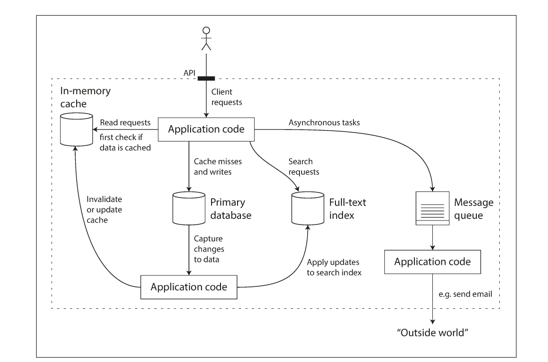
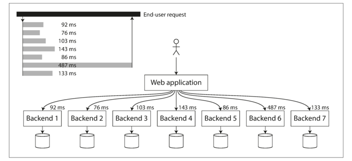

# 신뢰할 수 있고 확장 가능하며 유지보수하기 쉬운 애플리케이션

오늘날 많은 애플리케이션은 **계산 중심(compute-intensive)** 과는 다르게 **데이터 중심(data-intensive)** 적이다.    
CPU 성능보다 더 큰 문제는 보통 **데이터의 양**, **복잡도**, **변화 속도**이다

많은 애플리케이션은 다음을 필요로 한다
- 애플리케이션에서 다시 데이터를 찾을 수 있게 저장 // **데이터베이스(Database)**
- 읽기 속도 향상을 위해 값비싼 수행 결과를 기억 // **캐시(cache)**
- 키워드로 데이터를 검색하거나 다양한 방법으로 필터링할 수 있게 제공 // **검색 색인(search index)**
- 비동기 처리를 위해 다른 프로세스로 메시지 보내기 // **스트림 처리(stream processing)**
- 주기적으로 대량의 누적된 데이터를 분석 // **일괄 처리(batch processing)**

내부적으로 문제가 있어도 데이터를 정확하고 완전하게 유지하려면?   
시스템의 일부 성능이 저하되더라도 일관되게 좋은 성능을 제공하려면?   
부하 증가를 다루기 위해 규모를 확장하려면?   
이 책에서는 대부분의 소프트웨어에서 중요하게 여기는 세 가지 관심사에 중점을 둔다
- 신뢰성(Reliability): 하드웨어나 소프트웨어 결함, 인적오류(human error) 같은 **역경**에 직면하더라도 시스템은 지속적으로 **올바르게 동작**(원하는 성능 수준에서 정확한 기능 수행)
- 확장성(Scalability): 시스템의 데이터 양, 트래픽 양, 복잡도가 **증가**하면서 이를 처리할 수 있는 적절한 방법이 있어야 한다
- 유지보수성(Maintainability): 시간이 지남에 따라 여러 다양한 사람들이 시스템 상에서 작업할 것이기 때문에 모든 사용자가 시스템 상에서 **생산적으로** 작업할 수 있어야 한다

## 1. 신뢰성
"올바르게 동작함을 의미하는 경우", 대략 "무언가 잘못되더라고 지속적으로 올바르게 동작함"을 신뢰성의 의미로 이해할 수 있다.

- 애플리케이션은 사용자가 기대한 기능을 수행한다
- 시스템은 사용자가 범한 실수나 예상치 못한 소프트웨어 사용법을 허용할 수 있다
- 시스템 성능은 예상된 부하와 데이터 양에서 필수적인 사용 사례를 충분히 만족한다
- 시스템은 허가되지 않은 접근과 오남용을 방지한다

#### 결함과 장애
잘못될 수 있는 일을 **결함(fault)**이라 부른다.   
결함을 예측하고 대처할 수 있는 시스템을 **내결함성(fault-tolerant) 또는 탄력성(resilient)** 을 지녓다고 말한다.
결함은 장애(failure)와 동일하지 않다.  
결함은 사양에서 벗어난 시스템의 한 구성 요소로 정의되지만,    
**장애**는 사용자에게 필요한 서비스를 제공하지 못하고 시스템 전체가 멈춘 경우다.

결함 확률을 0으로 줄이는 것은 불가능하다. 따라서 결함으로 인해 장애가 발생하지 않게끔 내결함성 구조를 설계하는 것이 가장 좋다.   
그렇기 때문에 경고 없이 개별 프로세스를 무작위로 죽이는 것과 같이 고의적으로 결함을 유도함으로써 내결함성 시스템을 지속적으로 훈련하고 테스트 한다.

### 하드웨어 결함
장애율을 줄이기 위한 첫 번째 대응으로 하드웨어 구성 요소에 중복(redundancy)을 추가하는 방법이 일반적이다.   
최근까지 단일 장비의 전체 장애는 매우 드물기 때문에 대부분은 하드웨어 구성 요소의 중복으로 충분했다.   
하지만 데이터 양과 애플리케이션의 계산 요구가 늘어나면서 더 많은 애플리케이션이 많은 수의 장비를 사용하게 됬고 이와 비례해 하드웨어 결함율도 증가했다.   
따라서 내결함성 기술을 사용하거나 하드웨어 중복성을 추가해 전체 장비의 손실을 견딜 수 있는 시스템으로 옮겨가고 있다.

### 소프트웨어 오류
- 잘못된 입력의 경우 서버 인스턴스가 죽는 버그
- CPU, 메모리, 디스크, 네트워크 대역폭처럼 공유 자원을 과도하게 사용하는 일부 프로세스
- 속도가 느려 반응이 없거나 잘못된 응답을 반환하는 서비스
- 한 요소의 작은 결함이 다른 구성 요소의 결함을 야기하는 연쇄장애

소프트웨어 오류 문제는 신속한 해결책이 없다. 주의 깊은 생각, 빈틈없는 테스트, 프로세스 격리, 프로세스 재시작 허용, 모니터링, 분섣 등 여러 작은 일들이 도움을 줄 수 있다.

### 인적 오류
***사람이 미덥지 않음에도 시스템을 어떻게 신뢰성 있게 만들까?***

- 오류의 가능성을 최소화 하는 방향으로 설계하라. 추상화, API, 인터페이스를 사용하면 "옳은 일"은 쉽게 하고, "잘못된 일"은 막을 수 있다.
- 가장 많이 실수하는 장소에서 장애가 발생할 수 있는 부분을 분리하라. 실제 데이터를 이용해 테스트할 수 있지만, 사용자에게는 영향이 없는 비 프로덕션 샌드박스(sandbox)를 제공하라 // ??? 이게 뭔소리지
- 단위 테스트부터 통합테스트, 수동 테스트까지 철저하게 테스트하라. 자동화된 테스트는 특히 코너 케이스(corner case)를 다루는데 유용하다
- 장애 영향을 최소화하기 위해 인적 오류를 빠르고 쉽게 복구할 수 있게 하라.
- 성능 지표와 오류율 같은 상세하고 명확한 모니터링 대책을 마련하라.

## 2. 확장성
성능 저하를 유발하는 흔한 이유 중 하나는 부하 증가다.   
확장성을 논할 땐 "시스템이 특정 방식으로 커지면 이에 대처하기 위한 선택은 무엇인가?"와 "추가 부하를 다루기 위해 계산 자원을 어떻게 투입할까?" 같은 질문을 고려한다는 의미다

부하는 **부하 매개변수(load parameter)** 라 부르는 몇개의 숫자로 나타낼 수 있다.   
웹 서버의 초당 요청 수, 데이터베이스 read, write 비율, 대화방의 동시 활성 사용자, 캐시 적중율 등이 될 수 있다.

### 성능 기술하기

시스템 부하를 기술하면 부가가 증가할 때 어떤 일이 일어나는지 조사할 수 있다. 다음 두가지 방법으로 살펴볼 수 있다.
- 부하 매개변수를 증가시키고 시스템 자원(CPU, 메모리, 네트워크 대역폭)은 변경하지 않고 유지하면 시스템 성능은 어떻게 영향을 받을까?
- 부하 매개변수를 증가시켰을 때 성능이 변하지 않고 유지되길 원한다면 자원을 얼마나 많이 늘려야 할까?

일괄 처리 시스템은 보통 **처리량(throughput)**(초당 처리할 수 있는 레코드 수나 일정 크기의 데이터 집합으로 작업을 수행할 때 걸리는 전체 시간)에 관심을 가진다.   
온라인 시스템에서 더 중요한 사항은 **서비스 응답 시간(response time)**, 즉 클라이언트가 요청을 보내고 응답을 받는 사이의 시간이다.

**지연 시간**과 **응답 시간**을 종 종 같은 뜻으로 사용하지만 동일하지 않다.
- 응답 시간(response time): 응답 시간은 클라이언트 관점에서 본 시간으로, 요청을 처리하는 실제 시간(서비스 시간) 외에도 네트워크 지연과 큐 지연도 포함한다.
- 지연 시간(latency): 지연 시간은 요청이 처리되길 기다리는 시간으로 서비스를 기다리며 휴지(latent) 상태인 시간을 말한다.

다양한 요청을 다루는 시스템에서 응답 시간은 많이 변한다. 그러므로 응답 시간은 단일 숫자가 아닌 측정 가능한 값의 **분포**로 생각해야 한다.      
대부분의 요청을 꽤 빠르지만 가끔 오래 걸리는 **특이 값(outlier)** 이 있다. context switch, 패킷 손실, TCP 재전송 등 여러 원인으로 추가 지연이 생길 수 있다.   
서비스 **평균** 응답 시간을 살피는 일은 일반 적이지만 "전형적인" 응답 시간을 알고 싶다면 평균은 그다지 좋은 지표가 아니다. 많은 사용자가 실제로 지연을 경험했는지 알려주지 않기 때문이다.   
일반적으로 평균보다는 **백분위(percentile)** 를 사용하는 편이 더 좋다. 사용자가 보통 얼마나 오랫동안 기다려야 하는지 알고 싶다면 **중앙값(median)** 이 좋은 지표다.

특이 값의 상태를 알아보려면 백분위를 살펴보는 것이 좋다. **꼬리 지연 시간(tail latency)** 으로 알려진 상위 백분위 응답 시간은 사용자 경험에 직접 영향을 주기 때문에 중요하다.
백분위는 **서비스 수준 목표(service level objective, SLO)** 와 **서비스 수즌 협약서(service level agreement)** 에 자주 사용해 클라이언트의 기대치를 설정하는데 자주 사용한다.

// 이부분 확실히 이해가 안된다...?
큐 대기 지연(queueing delay)는 높은 백분위에서 응답 시간의 상당 부분을 차지하는데 소수의 느린 처리만으로도 후속 요청 처리가 지체된다.  
이 현상을 **선두 차단(head-of-line blocking)** 이라 한다. 후속 요청이 빠르게 처리되더라도 이전 요청이 완료되길 기다리는 시간때문에 전체적인 응답 시간이 느리다고 생각할 수 있다.

#### 실전 백분위
병렬로 호출해도 최종 사용자 요청은 병렬 호줄 중 가장 느린 호출이 완료되길 기다려야 한다. 작은 비율의 호출만 느려도 최종 사용자 요청이 여러번 호출하면 느린 호출이 발생할 가능성이 증가한다.
이 효과를 **꼬리 지연 증폭(tail latency amplification)**이라 한다. 

### 부하 대응 접근 방식
확장성과 관련해 흔히 두가지로 구분해서 말하곤 한다.   
**용량 확장(scaling up) 수직 확장(vertical scaling)**: 좀 더 강력한 장비로 이동   
**규모 확장(scaling out) 수평 확장(horizontal scaling)**: 다수의 낮은 사양 장비   
다수의 장비에 부하를 분산하는 아키텍처를 **비공유(shared-nothing)** 아키텍처라 부른다. 단일 장비 시스템은 간단하지만 고사양 장비는 비싸고, 집약 작업 부하는 규모 확장을 피하지 못한다.
현실적으로 적절한 사양의 장비 몇 대가 다량의 낮은 사양 가상 장비보다 간단하고 저렴하다.

대개 대규모로 동작하는 시스템의 아키텍처는 해당 시스템을 사용하는 애플리케이션에 특화돼 있다. 모든 상황에 맞는 확장 아키텍처는 없다.    
특정 애플리케이션에 적합한 확장성을 갖춘 아키텍처는 주요 동작이 무엇이고 잘 하지 않는 동작이 무엇인지에 대한 가정을 바탕으로 구축한다.

## 3. 유지보수성
주의해야할 소프트웨어 시스템 설계 원칙은 다음 세 가지다
- 운용성(operability): 운영팀이 시스템을 원활하게 운영할 수 있게 쉽게 만들어라
- 단순성(simplicity): 복잡도를 최대한 제거해 새로운 엔지니어가 시스템을 이해하기 쉽게 만들어라
- 발전성(evolvability): 변화에 유연하게 하라. 그래야 요구사항이 변경되었을 때 적용하기 쉽다.

### 운용성: 운영의 편리함
- 시스템 상태 모니터링하여 문제가 생기면 서비스를 복원
- 장애, 성능 저하 등의 문제 원인 추적
- 보안을 포함해 소프트웨어와 플랫폼을 최신 상태로 유지
- 문제가 생길 수 있는 변경 사항을 손상을 입히기 전에 차단
- 발생 가능한 문제를 예측해 해결
- 좋은 모니터링으로 런타임 동작과 시스템 내부의 대한 가시성 제공
- 자동화와 통합을 위한 우수한 지원을 제공
- 개별 장비 의존성을 회피. 장비를 내리더라고 시스템 전체에 영향을 주지 않고 운영 가능해야함
- 좋은 문서와 운영 모델 제공
- 적절한 자기 회복과 필요에 따라 관리자가 시스템 상태를 수동으로 제어할 수 있게 함

### 단순성: 복잡도 관리
복잡도를 제거하기 위한 최상의 도구는 추상화다. 좋은 추상화는 깔끔하고 직관적인 외간 아래로 많은 세부 구현을 숨길 수 있다.

### 발전성: 변화를 쉽게 만들기
요구사항이 바뀌지 않을 가능성은 매우 적다. 변화에 유연한 시스템을 맞추는 방법은 간단, 추상화와 관련이 있다. 이해하기 쉬운 시스템은 수정하기 쉽다.
