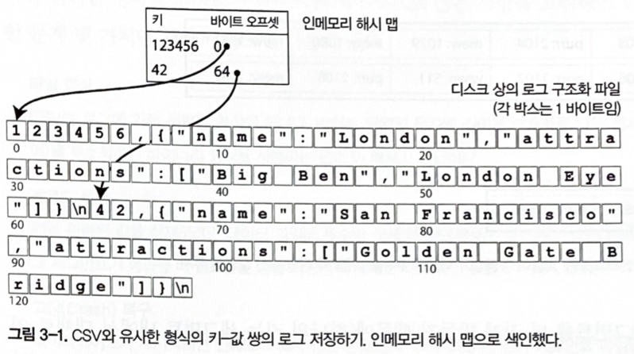
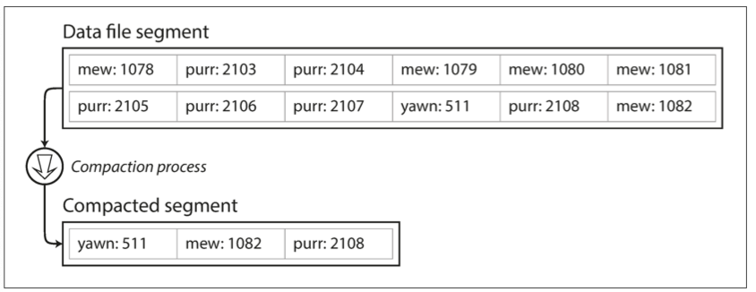
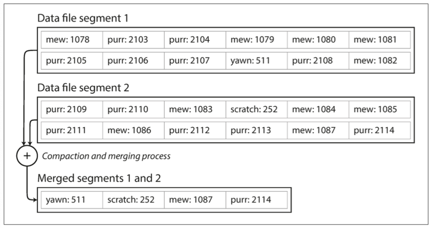
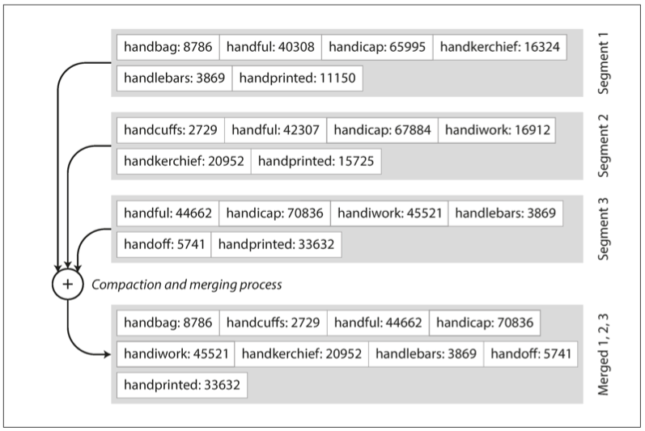
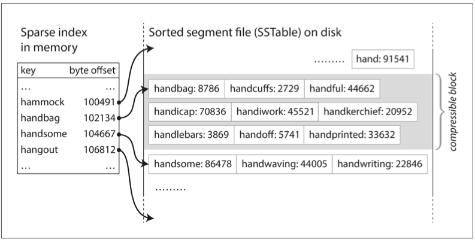
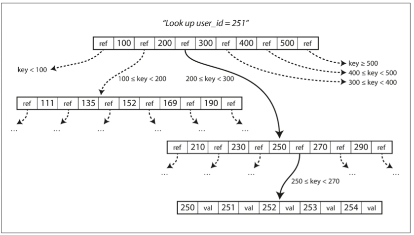

# 저장소와 검색

- 데이터를 **저장**하는 방법과 다시 **읽는** 방법에 대해 알아본다.
- 저장소 엔진
    - 로그 구조(log-structured) 계열 저장소 엔진
    - B트리(B-tree) 같은 페이지 저향(page-oriented) 계열 저장소 엔진

#### 로그(log)란?
- 애플리케이션에서 무슨 일이 일어나는지 기술한 텍스트.
- 연속된 추가 전용(append-only) 레코드를 말한다.
- 많은 데이터베이스는 내부적으로 추가 전용(apend-only) 데이터 파일인 로그(log)를 사용한다

## 검색 성능
- 문제점
    - 키가 있는지 찾기 위해 데이터베이스 파일을 처음부터 끝까지 스캔해야 한다. // O(n)
    - 레코드 수가 두배로 늘면, 검색도 두배로 오래 걸린다.
- 개선방법
  - 특정 키의 값을 효율적으로 찾기 위해 색인(index, 다른 데이터 구조)이 필요하다.
  - 어떤 부가적인 메타데이터를 유지하는 것
  - 메타데이터는 이정표 역할을 해서 원하는 데이터 위치에 찾은데 도움을 준다.
  - 여러가지 다양한 방법으로 검색하고자 한다면, 데이터의 각 여러 가지 다양한 색인이 필요하다.

## 색인
- 구조
    - 색인은 기본 데이터(primary data)에서 파생된 추가적인 구조다.
    - 색인은 질의 성능에 영향을 준다.
    - 쓰기 과정에서 오버헤드가 발생 (쓰기 연산마다 색인을 갱신해야 하기 때문).
- trade off
  - 잘 선택된 색인은 읽기 질의 속도 향상
  - 모든 색인은 쓰기 속도를 저하

## 해시 색인
- 키-값 데이터는 매우 일반적이고 더욱 복잡한 색인을 위한 구성 요소로 유용.
- 사전 타입(Dictionary type) 유사하고, Hash map(Hash table)으로 구현.
- 키를 데이터 파일의 **바이트 오프셋(byte offset)** 에 매핑해서 인메모리(in-memory) 해시 맵을 유지하는 전략으로 색인에 접근해 보자.

- 해시맵을 전부 메모리에 유지하기 때문에 RAM에 모든 키가 저장된다는 조건을 전제로 고성능 읽기, 쓰기를 보장.
- 한번의 디스크 탐색으로 디스크에 적재할 수 있기 때문에 사용 가능한 메모리보다 더 많은 공간을 사용할 수 있다.
- 데이터 파일의 일부가 파일 시스템 캐시에 있다면 읽기에 디스크 입출력도 필요하지 않다.
- 이런 형태의 저장소는 각 key의 value가 자주 갱신되는 상황에 적합하다.

#### 디스크 공간 부족의 해결책
- 특정 크기에 도달하면 세그먼트 파일을 닫고 새로운 세그먼트 파일에 쓰기를 수행.
- 그리고 세그먼트 파일에 대해 **컴팩션(compaction)**을 수행한다.
  - 컴팩션(compaction): 중복된 키를 버리고 각 키의 최신 갱신 값만 유지하는 것.

#### 컴팩션과 세그먼트 병합
- 컴팩션은 세그먼트를 더 작게 만들 수 때문에, 컴팩션을 수행할 때는 동시에 여러 세그먼트들을 병합할 수 있다.
- 고정된 세그먼트의 병합과 컴팩션을 백그라운드로 스레드로 수행할 수 있어, 컴팩션을 수행하는 동안 이전 세그먼트 파일을 사용해 읽기와 쓰기 요청의 처리를 정상적으로 계속 수행할 수 있다.
- 병합 과정이 끝난 이후에는 읽기 요청은 이전 세그먼트 대신 새로 병합한 세그먼트를 사용하게끔 전환한다.
- 전환 후에는 이전 세그먼트 파일을 삭제하면 된다.

##### 실제 구현할 때 주의해야 할 점
- 파일 형식 // ?? 왜?
  - key-value 를 구분하는 것이 콤마(,) 이다. 그렇다고 해서 CSV 가 적합한 형식은 아니다.
  - 문자열을 부호화하는 바이너리 형식을 사용하는 것이 더 빠르고 간단하다.
- 레코드 삭제 // ?? 왜?
  - 키에 해당하는 값을 삭제하려면, 데이터 파일에 특수한 삭제 레코드(Tombstone, 묘비)를 추가해야 한다.
  - 로그 세그먼트 이 톰스톰을 병합 과정에서 삭제된 키의 이전 값을 무시하게 한다.
- 고장(Crash) 복구
  - 데이터베이스가 재시작되면 in-memory hash map은 손실된다.
  - 데이터가 커지면 hash map을 복원하는데 오래 걸리기 때문에 스냅샷(Snapshot)을 만들어 디스크에 저장하여 복구 속도를 높일 수 있다.
- 부분적으로 레코드 쓰기
  - 데이터베이스에서 로그에 레코드를 추가하는 도중에 죽을 수 있다.
  - 비트캐스크 파일은 checksum을 포함하고 있어서 로그의 손상된 부분을 탐지해 무시할 수 있다.
- 동시성 제어
  - 순차적으로 로그에 추가할 때 일반적인 구현하는 방법은 실글 스레드만 사용한다.
  - 읽기는 불변(immutable)이므로, 멀티 스레드로 동시에 읽기를 할 수 있다.

#### 추가 전용(append-only) 로그의 이점
- append-only 와 segment 병합은 순차적인 쓰기 작업이기 때문에 보통 무작위 쓰기보다 빠르다.
- 특히 자기 회전 디스크 하드 드라이브에서 더 빠르다.
- segment 파일이 추가 전용이나 불변이면 동시성과 고장 복구가 간단하다.
- 값을 덮어 쓰는 동안 DB 가 죽는 경우에 대해서 걱정할 필요가 없다. 이전 값 부분과 새로운 값 부분을 포함한 파일을 나누어 함께 남겨두기 때문.
- 오래된 segment 병합은 시간이 지남에 따라 조각화되는 데이터 파일 문제를 피할 수 있다.

#### 해시 테이블 색인 제한 사항
- 메모리 저장해야 하므로 키가 너무 많으면 문제가 된다.
- 디스크에 hash map 을 유지할 수 있지만 디스크 상에서 좋은 성능을 기대하기 어렵다.
- 이는 무작위 접근 I/O 가 많이 발생하고 **디스크가 가득 찼을 때 확장하는 비용이 비싸** 해시 충돌 해소가 힘들다.
- **범위 질의에 효율적이지 않다**. 해시 맵에서 모든 개별 키를 조회해야 한다.

## SS테이블과 LSM 트리
- 키로 정렬된 형식을 정렬된 **문자열 테이블(Sorted String Table, SS테이블)** 이라고 한다.
- 각 키가 병합된 세그먼트 파일 내에는 한번만 나타나야 한다(이미 컴팩트 과정이 이를 이미 보장).

- 장점
  - 세그먼트 병합은 파일이 사용가능한 메모리보다 크더라도 간단하고 효율적이다.
  
  - 모든 키를 메모리에 색인으로 유지할 필요가 없다.
  
  - 읽기 요청은 범위 내에서 key-value를 스캔해야 한다. 디스크에 쓰기 전에 압축하면 key는 압축된 블록의 시작을 가리키게 된다.

## SS테이블 생성과 유지
- 디스크에 정렬된 구조를 유지하는 것은 가능하지만(B트리 참조), 메모리에 유지하는 편이 더 쉽다.
- 임의 순서로 키를 삽입하고 정렬된 순서로 해당 키를 다시 읽을 수 있다.

## B트리
- 정렬된 키-값을 유지하기 때문에 키-값 검색과 범위 질의에 효과적

- 분기 계수(branching factor): 한 페이지에서 하위 페이지를 참조하는 수 
- 트리가 계속 균형을 유지하는 것을 보장한다.
- n개의 키를 가진 B 트리는 깊이가 항상 O(logn) 이다.

## 신뢰할 수 있는 B트리 만들기
- 데이터 고장시 복구
  - 일부 페이지만 기록하고 데이터베이스가 고장이 난다면 결국 색인이 훼손되기 때문에 위험하다.
  - 데이터베이스가 스스로 복구하게 하려면, 쓰기전 로그(Write-ahead log, WAL, (재실행 로그, redo log)라고도 함)라는 데이터 구조를 추가해 B-Tree를 복원하는데 사용한다.

- 동시성 제어
  - 다중 스레드가 동시에 B-Tree에 접근한다면 주의 깊게 동시성 제어를 해야하는데, 이때 랜치(latch, 가벼운 잠금(lock))로 트리를 보호한다.

## B트리 최적화
- 페이지 덮어쓰기와 WAL을 유지하는 대신, 쓰기 시 복사 방식(copy-on-write scheme)을 사용한다. 변경된 페이지는 다른 위치에 기록하고 트리 상위 페이지의 새로운 버젼을 만들어 새로운 위치를 가리킨다.
- 페이지에 전체 키를 저장하는 것이 아니라 키를 축약해 쓰면 공간을 절약할 수 있다. 페이지 하나에 키를 더 많이 채워 더 높은 분기 계수를 얻는다.
- 페이지는 디스크 상 어디든지 존재할 수 있다. 하지만 leaf 페이지 만큼은 디스크 상 연속된 순서로 나타나게끔 트리를 배치하려 시도한다.(하지만 트리가 커진다면 어렵다)
- 트리에 포인터를 추가하여, 상위 페이지로 이동하지 않고 형제 페이지로 바로 이동하게 만들 수 있다.

