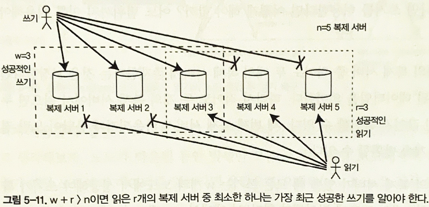

# 복제

복제가 필요한 이유
- 지리적으로 사용자와 가깝게 데이터를 유지해 지연 시간을 줄인다.
- 시스템의 일부에 장애가 발생해도 지속적으로 동작할 수 있게 해 가용성을 높인다.
- 읽기 질의를 제공하는 장비의 수를 확장해 읽기 처리량을 늘린다.

복제 알고리즘
- 단일 리더(single-leader)
- 다중 리더(multi-leader)
- 리더가 없음(leaderless)

## 리더와 팔로워
**복제 서버(replica)** 데이터 베이스의 복사본을 저장하는 각 노드

## 리더 기반 복제
=(마스터 슬레이브 복제(master slave replication), 능동/수동 복제(active/passive replication))
- 리더(leader)
    - =마스터, 프라이머리(primary)
    - 클라이언트의 쓰기, 읽기 요청을 처리
    - 쓰기 기록 후 팔로워에게 이를 전달
- 팔로워(follower)
    - =읽기 복제 서버(read replica), 슬레이브, 2차(secondary), 핫 대기(hot standby)
    - 리더가 보낸 데이터 변경 로그, 변경 스트림을 전달 받아 데이터 복제본을 갱신
    - 클라이언트의 읽기 요청 만을 처리
- 장단점
    - 리더가 잘못되고 복구 불가능한 경우 팔로워에 복제되지 않은 쓰기는 유실
    - 클라이언트가 어떤 쓰기를 확인했어도 해당 쓰기의 지속성을 보장할 수 없음
    - 모든 팔로워가 잘못되어도 리더가 쓰기 처리를 계속할 수 있다.
    - 내구성이 약하다는 단점에도 불구하고 다음과 같은 조건 하에 많이 사용된다.
        - 많은 팔로워가 존재하는 경우
        - 노드가 지리적으로 분산된 경우

### 동기식 vs 비동기식 복제

- 동기식 복제
    - (그림 5-2) 팔로워1의 경우
    - 리더가 팔로워의 쓰기 수신에 대한 응답을 확인하기 위해 대기한다.
    - 확인이 끝나면 사용자에게 성공을 보고 후 해당 쓰기를 보여준다.
    - 장단점
        - 리더와 팔로워의 일관성(최신 데이터)을 보장한다.
        - 팔로워가 응답하지 않을 시(장애, 결함, 네트워크 등의 문제로) 쓰기가 처리될 수 없다.
        - 리더는 모든 쓰기를 차단(block)하고 팔로워가 사용가능할 때 까지 기다려야 한다.
- 비동기식 복제
    - (그림 5-2) 팔로워2의 경우
    - 리더가 팔로워의 쓰기 수신에 대한 응답을 기다리지 않는다.
    - 일관성은 떨어지지만, 사용자 응답 시간이 짧고 고가용성 제공
- 반동기식(semi-synchronous)
    - 모든 팔로워가 동기식 복제 방식을 사용할 수는 없다. 하나의 노드만 고장나도 전체 시스템이 마비.
    - 팔로워 하나는 동기식, 나머지는 비동기 식으로 구성하는 것을 의미
    - 동기식 팔로워가 사용 불가 시 → 다른 비동기 팔로워가 동기식으로 동작
    - 적어도 두 노드(리더, 동기식 팔로워)에 데이터의 최신 복사본이 존재
    - 완전한 비동기식 리더 기반 복제 방식에서 일반적으로 선택

### 새로운 팔로워 설정

- 새로운 팔로워 설정이 필요한 경우
    - 복제 서버의 수를 늘려야 하는 경우
    - 장애 노드를 대체하는 경우
- Q. 새로운 팔로워의 추가 설정은 어떻게 진행해야 할까?
    - A1. 데이터 파일을 복사한다. (X)
      - 복사하는 와중에도 클라이언트의 쓰기 요청은 계속 발생한다. 파일의 복사본은 유효하지 않은(out-of-date) 데이터를 포함한다.
    - A2. 일관성을 보장하기 위해 데이터베이스를 잠가 잠시동안 쓰기를 막는다. (X)
      - 고가용성 목표에 부합하지 않는다.
    - A3. 다음과 같이 중단 없이 팔로워 설정을 수행한다. (O)
        - 데이터베이스를 잠그지 않고 리더의 데이터베이스 스냅샷을 가져온다.
        - 스냅샷을 새로운 팔로워 노드에 복사한다.
        - 이후 팔로워는 리더에 연결해 스냅샷 이후 발생한 모든 데이터 변경 내역을 요청한다.
        - 요청한 데이터 변경 미처리분(backlog)을 모두 처리하면 팔로워가 리더를 따라잡았다고 말한다.
        - 이제 팔로워는 리더의 데이터 변경을 처리할 수 있다.
          - 노드 중단 처리
          - 시스템의 모든 노드는 다음과 같은 사유로 중단될 수 있다.

### 노드 중단 처리
- 시스템의 모든 노드는 다음과 같은 사유로 중단될 수 있다.
    - 장애
    - 계획된 유지보수
- 단일 노드는 중단 되더라도 전체 시스템은 중단되지 않고 서비스되어야 한다.
- 개별 노드의 장애애도 전체 시스템이 잘 동작하고 노드 중단의 영향을 최소화하는 것이 목표다.

#### 팔로워 장애: 따라잡기 복구
- 팔로워는 리더로부터 수신한 데이터 변경 로그를 로컬 디스크에 보관
- 팔로워가 죽거나, 네트워크 중단 등으로 복구하는 경우 로그를 이용하여 복구를 시작할 수 있다.
- 로그에서 마지막으로 처리된 트랜잭션을 찾는다.
- 해당 트랜잭션 이후의 데이터 변경 내역을 리더에 요청
- 요청한 변경 내역을 모두 적용하면 리더를 따라잡아 복구가 완료된다.

#### 리더 장애: 장애 복구
- 팔로워 중 하나를 새로운 리더로 승격
- 클라이언트는 새로운 리더로 쓰기를 전송해야 함. → 재설정이 필요하다.
- 다른 팔로워는 새로운 리더로부터 데이터 변경을 소비하기 시작
- 수동 또는 자동으로 진행한다.

- 자동 장애 복구 과정
    1. 리더가 장애인지 판단
        - 판단할 수 있는 확실한 방법은 없음 → 보통 타임아웃을 사용
        - 노드 간 메시지를 주고 받고 일정시간 응답하지 않는 노드는 죽은 것으로 간주
        - 예외도 존재, 리더가 계획된 유지 보수를 위해 의도적으로 중단되는 경우
    2. 새로운 리더를 선택
        - 복제 노드들이 새로운 리더를 선출
        - 보통 이전 리더의 최신 데이터 변경사항을 가진 복제 서버가 새로운 리더의 가장 적합한 후보로 지목
    3. 새로운 리더 사용을 위해 시스템을 재설정한다.
        - 클라이언트의 쓰기 요청, 팔로워의 데이터 변경 로그 재설정
        - 이전 리더가 복구되는 경우 이전 리더가 새로운 리더를 인식하고 자신은 팔로워가 된다.
       

- 자동 장애 복구 과정에서의 위험
    - 내구성을 보장하지 않음
        - 비동기식 복제 사용 시 새로운 리더는 이전 리더의 최신 쓰기 중 일부를 받지 못했을 수 있음
        - 이전 리더가 다시 클러스터에 추가되면 해당 최신 쓰기 내역은 어떻게 해야 하는가?
        - 새로운 리더가 이와 충돌하는 쓰기를 받았을 수 있음 → 해당 쓰기를 폐기하는 것이 일반적
        - 클라이언트 입장에서 내구성을 신뢰할 수 없음.
    - Github 실제 사례, MySQL과 Redis 간 데이터 불일치
        - MySQL의 팔로워가 리더로 승격. 이 팔로워가 이전 리더의 쓰기 내역을 완벽히 갱신하지 못함
        - 새로운 리더에는 없고, 이전 리더에만 존재하는 기본키를 레디스에서는 사용하고 있었음.
        - 새로운 팔로워는 이미 할당된 기본키를 재사용 → 레디스와 MySQL간의 데이터 불일치 발생
      - 스플릿 브레인(Split Brain)
          - 특정 결함 시나리오에서 두 노드가 자신이 리더라고 인식
          - 두 리더가 각자 쓰기 요청을 처리하기 때문에 쓰기 충돌이 발생
          - 쓰기 충돌을 해소하지 못하면 데이터가 유실 또는 오염된다.
          - 둘 이상의 리더가 감지되면 하나를 종료하는 메커니즘도 있으나 잘못 설계 시 둘 모두가 종료될 수 있음
      - 죽었다고 판단하기에 적절한 타임아웃 값을 정하기가 어렵다.
          - 너무 길면 → 복구에 너무 오랜 시간이 소요
          - 너무 짧으면 → 불필요한 장애복구 발생
          - 노드의 응답시간은 일시적인 부하 급증, 네트워크 문제 등으로 일정할 수 없다.
          - 시스템이 높은 부하, 네트워크 문제와 씨름 중인 경우 불필요한 장애 복구는 상황을 악화시킬 수 있음.
        
### 복제 로그 구현
- 구문(Statement) 기반 복제
    - 요청받은 구문을 기록하고 쓰기를 실행한 다음 구문을 팔로워에게 전송
        - RDB : INSERT, UPDATE, DELETE …
    - 비결정적인 요인에 의해 복제가 깨질 수 있다.
        - NOW(), RAND() 등은 복제 서버마다 다른 값을 생성할 가능성이 존재
        - 자동증가 컬럼을 사용하거나, 기존 데이터에 의존하는 경우(WHERE) 정확히 같은 순서로 실행되어야 함
        - 순서가 다르면 구문의 효과가 다를 수 있음 → 동시에 여러 트랜잭션이 수행되는 것을 제한한다.
        - 부수효과를 가진 구문의 경우 부수효과가 완벽히 결정적이어야 모든 팔로워에서 그 효과도 동일하다.
    - 리더가 구문 기록 시 비결정적 함수 호출을 고정 값을 반환하도록 대체(하지만 여러 에지 케이스가 있어 현재는 다른 방식을 선호) // what..?

- 쓰기 전 로그(WAL, write-ahead log) 배송
    - 일반적으로 데이터베이스의 모든 쓰기는 로그에 기록이 된다.
    - 리더가 로그를 팔로워에게 전송하고, 팔로워는 이 로그를 처리함으로써 복제한다.
    - 로그는 제일 저수준의 데이터를 기술함
        - 디스크 블록에서 어떤 데이터를 변경했는 지와 같은 상세 정보 포함
        - 복제 프로세스가 저장소 엔진과 밀접하게 연관된다.
        - 리더와 팔로워가 동일한 소프트웨어 버전에서 실행되어야 한다.
        - 소프트웨어 업그레이드 시 중단 시간이 필요하다.

- 논리적(로우 기반) 로그 복제
    - 로그를 저장소 엔진과 분리하기 위한 대안으로 복제와 저장소 엔진에 각기 다른 로그 형식을 사용한다.
    - 논리적 로그(logical log)
        - 복제에서 사용하는 로그를 저장소 엔진의 물리적 데이터 표현과 구별하여 부른다.
        - 여러 로우를 수정하는 트랜잭션은 여러 로그 레코드를 생성한 다음 트랜잭션 커밋을 레코드에 표시
    - 논리적 로그와 저장소 엔진 내부를 분리
        - 하위 호환성을 유지
        - 리더와 팔로워가 각기 다른 버전의 소프트웨어에서 실행 가능
        - 트리거 기반 복제
        - 지금까지 설명한 복제 방식은 애플리케이션의 관여 없이 DB 시스템에 의해 구현되었다.

- 트리거 기반 복제
    - 사용자 정의 애플리케이션 코드를 등록할 수 있다.
    - 데이터 변경 시(쓰기 트랜잭션) 자동으로 실행된다.
    - 트리거를 통해 데이터 변경을 분리된 테이블에 로깅한다.
    - 이 테이블에 기록된 데이터 변경을 외부 프로세스가 읽고 처리한다.
    - 필요한 애플리케이션 로직 적용 후 다른 시스템으로 데이터를 복제한다.
    - 장단점
        - 트리거 기반 복제는 다른 복제 방식보다 많은 오버헤드가 있다.
        - 데이터베이스에 내장된 복제보다 버그나 제한 사항이 더 많이 발생한다.
        - 그럼에도 불구하고 유연성 때문에 매우 유용하다.

### 복제 지연 문제

- 읽기 확장(read-scaling) 아키텍처
    - 하나의 리더와 여러 팔로워로 구성
    - 리더: 읽기+쓰기, 팔로워: 읽기
    - 장점
        - 웹 서비스의 경우 읽기 요청이 대부분, 쓰기 요청은 작은 비율로 구성
        - 리더의 부하를 경감하고 복제 서버에서 읽기 요청을 처리
        - 복제의 목표 중 확장성, 지연시간 단축 달성
    - 단점
        - 동기식 복제는 단일 노드의 장애, 네트워크 중단이 전체 시스템의 쓰기를 마비시켜 적절하지 않다.
        - 노드가 많아질 수록 다운될 가능성이 커져 동기식 설정과 적절하지 않다.
    - 일시적인 데이터 불일치와 최종적 일관성
        - 비동기 팔로워에서 데이터를 읽을 경우 지난 데이터를 읽을 수 있음 → 데이터 불일치 발생
        - 불일치는 일시적이다. 결국 팔로워는 리더를 따라잡게 된다. → 최종적 일관성
      
    > **최종적 일관성 (Eventual Consistency)**   
      분산 컴퓨팅 환경에서 사용되는 일관성 모델 중 하나. 일시적으로는 데이터의 일관성이 깨지는 것을 허용한다.
      그러나 최종적으로는 (데이터의 변경사항이 없다면) 데이터 대한 모든 접근들에 대해 마지막으로 갱신된 값을 반환하는 것을 보장한다.

- 복제 지연
    - 정상적인 경우 복제 지연으로 인한 데이터 불일치는 찰나의 순간이며 크게 문제가 되지 않는다.
    - 시스템이 가용량 근처에서 동작하거나 네트워크 문제가 있다면 복제 지연으로 인한 불일치가 문제가 될 수 있다.

#### 자신이 쓴 내용 읽기
- 쓰기 후 읽기(read-after-write) 일관성
    - 사용자가 페이지를 리로딩하면 자신이 제출한 모든 갱신을 볼수 있음을 보장한다.
    - 다른 사용자가 제출한 것에 대해서는 보장하지 않는다.

- 쓰기 후 읽기 일관성 구현하기
    1. 리더 기반 복제 시스템에서 
        - 사용자가 수정한 내용을 읽을 때에는 리더에서 이 외의 경우는 팔로워에서 읽는다.
            - ex. SNS
                - 사용자 프로필은 소유자 자신만 편집이 가능하다. → 자신의 프로필 조회는 리더에서 조회
                - 다른 사용자의 프로필은 팔로워에서 조회
        - 시간을 기준으로 판단하기
            - 레코드의 마지막 갱신 시각을 기준으로(ex. 1분 이내) 리더 읽기 여부를 구분하기
            - 팔로워에서 복제 지연을 모니터링 하여 1분 이상 늦은 팔로워에 대한 질의 금지
        - 클라이언트가 기억하는 가장 최근 쓰기의 타임스탬프를 기억하기
            - 시스템은 팔로워에게 타임스탬프까지 갱신을 반영하도록 할 수 있음
            - 복제서버에 아직 갱신이 반영되지 않았다면?
                - 다른 복제 서버가 읽기 요청을 처리
                - 복제 서버에 갱신이 반영될 때 까지 질의를 대기
            - 타임스탬프는 논리적 의미의 타임스탬프 또는 실제 시스템 시간일 수 있음
        - 복제 서버가 여러 데이터센터에 분산된 경우
            - 리더가 제공해야하는 요청은 전부 리더가 포함된 데이터센터로 라우팅되어야 한다.
    2. 디바이스 간(cross-device) 쓰기 후 읽기 일관성
        - 동일한 사용자가 여러 디바이스(데스크톱 웹 브라우저, 모바일 앱)로 서비스에 접근하는 경우
        - 디바이스 간 쓰기 후 읽기 일관성이 보장되어야 한다.
        - 사용자의 마지막 갱신 타임스탬프의 경우 다른 디바이스에서는 알 수가 없다.
            - 이러한 메타데이터를 중앙집중식으로 관리해야 다른 디바이스에서도 확인이 가능하다.
        - 복제 서버가 여러 데이터센터 간에 분산된 경우
            - 다른 디바이스의 연결이 동일한 데이터센터로 라우팅된다는 보장이 없다.
            - 데스크톱 → 홈 광대역 연결, 모바일 기기 → 셀룰러 데이터 네트워크
            - 각 디바이스의 네트워크 라우팅은 완전히 다르다.
            - 사용자 디바이스의 요청을 동일한 데이터센터로 라우팅해야 한다.
        
    
#### 단조 읽기

- 시간이 거꾸로 흐르는 현상
    - 팔로워 간에도 동일한 쓰기에 대해 갱신 시점의 차이가 존재한다.
    - 어떤 팔로워는 쓰기를 알고 있으나, 어떤 팔로워는 모른다면 시간이 거꾸로 흐르는 현상을 겪을 수 있다.

- **단조 읽기(monotonic read)**
    - 위와 같은 종류의 이상 현상이 발생하지 않음을 보장한다.
    - 강한 일관성 보다는 덜하고, 최종적 일관성 보다는 강한 보장이다.
    - 한 사용자가 여러 번에 걸쳐 읽어도 시간이 되돌아가는 현상을 경험하지 않는다.
    - 이전에 새로운 데이터를 읽은 후에는 예전 데이터를 읽지 않는다.
    - 달성하는 방법
        - 각 사용자의 읽기가 항상 동일한 복제 서버에서 수행되도록 한다.
        - 사용자 ID의 해시를 기반으로 복제 서버를 선택
        - 복제 서버가 고장나면 사용자 질의를 다른 복제 서버로 재라우팅할 필요가 있음

#### 일관된 순서로 읽기

- 대화 
    - 푼스 씨 : 미래에 대해 얼마나 멀리 볼 수 있나요. 케이크 부인?
    - 케이크 부인 : 보통 10초 정도요, 푼스 씨.
- 관찰자 입장
    - 케이크 부인 : 보통 10초 정도요, 푼스 씨.
    - 푼스 씨 : 미래에 대해 얼마나 멀리 볼 수 있나요. 케이크 부인?

- 일관된 순서로 읽기(consistence prefix read)
    - 이러한 이상현상을 방지하기 위해 일관된 순서로 읽기와 같은 유형의 보장이 필요
    - 일련의 쓰기가 특정 순서로 발생한 경우 다른 사용자에게도 쓰기에 대해 쓰여진 순서대로 읽는 것을 보장
    - 인과성의 위반
        - **파티셔닝(샤딩)**된 데이터베이스에서 발생하는 특징적인 문제
        - 많은 분산 데이터베이스에서 파티션은 서로 독립적으로 동작 → 쓰기의 전역 순서가 없음
        - 한 가지 해결책은 서로 인과성이 있는 쓰기에 대해 동일한 파티션에 기록되도록 하는 방법
        - 그러나 일부 애플리케이션에서 효율적이지 않음
        - 인과성을 명시하기 위한 알고리즘 → 이후(이전 발생 관계와 동시성)에 다룰 예정

#### 복제 지연을 위한 해결책
- 쓰기 후 읽기와 같은 강한 보장을 제공하도록 시스템을 설계
    - 비동기식 복제를 사용하지만 동기식 방식으로 동작하는 것 처럼 보인다.
- 애플리케이션이 데이터베이스보다 더 강력한 보장을 제공하는 방법도 있다.
    - ex. 특정 종류의 리더에서 읽기를 수행
    - 그러나 애플리케이션에서 다루기에는 복잡하여 잘못되기 쉽다.

## 다중 리더 복제
- 다중 리더
    - 각 리더는 동시에 다른 리더의 팔로워 역할도 함
    - 모든 쓰기를 해당 리더를 거쳐야 하고, 리더 연결이 불가능한 경우 쓰기 불가능 단점 보완

- 다중 리더 설정
    - 각 데이터 센터 간 리더가 다른 데이터 센터 리더에게 변경 사항 복제
    - 동일한 데이터를 다른 두 개의 데이터센터에서 동시에 변경 가능하므로 쓰기 충돌은 반드시 해소되어야함
    - 일부 데이터베이스는 기본적으로 다중 리더 설정 제공

- 다중 데이터 센터 배포에서 단일 리더, 다중 리더 설정 비교
    - 성능
        - 단일 리더 : 인터넷을 통해 리더가 있는 데이터 센터로 이동해야해서 쓰기 지연 발생
        - 다중 리더 : 로컬 데이터센터 처리 후 비동기 방식으로 다른 데이터센터에 복제
    - 데이터센터 중단 내성
        - 단일 리더 : 리더가 있는 데이터센터가 고장 나면 다른 데이터센터의 팔로워를 리더로 승진
        - 다중 리더 : 각 데이터센터 독립적으로 동작, 고장난 데이터센터가 온라인으로 돌아왔을때 복제
    - 네트워크 문제 내성
        - 단일 리더 : 데이터 센터 내 쓰기는 동기식이기에 데이터 센터 내 연결 문제에 민감
        - 다중 리더 : 비동기 복제를 사용해 네트워크 문제에 보다 잘 견딤, 일시적 네트워크 중단에도 쓰기 처리는 진행되기 때문

- 사용 사례: 오프라인 작업을 하는 클라이언트
    - 인터넷 연결이 끊어진 동안 애플리케이션 동작해야 하는 경우
      - 리더처럼 동작하는 로컬 데이터베이스가 있어 인터넷 접근이 가능해진 시점에 복제
    - 협업 편집: 동시에 여러 사람이 문서를 편집할 수 있는 애플리케이션 ex) 이더패드, 구글 독스 등
      - 자세한 알고리즘은 "자동 충돌 해소"에서 설명

#### 쓰기 충돌 다루기

- 다중 리더 복제에서 가장 큰 문제는 쓰기 충돌
- 각 사용자가 동시에 편집 후 로컬 리더에 저장하였으나 변경을 비동기로 복제 시 쓰기 충돌 발생
- 동기식으로 충돌 감지를 하면 다중 리더 복제의 장점을 잃어버림

##### 충돌 회피
- 충돌 처리하는 가장 간단한 전략
- 충돌 처리가 어려워 충돌 피하는 것이 자주 권장됨
- 특정 레코드의 모든 쓰기를 동일한 리더에서 처리함
    - ex) 특정 사용자의 요청을 동일한 데이터센터로 라우팅하고 데이터센터 내 리더를 사용해 읽기와 쓰기를 하게끔 보장

##### 일관된 상태 수렴
- 모든 복제 서버가 동일해야 함이 원칙
- 수렴(convergent) : 모든 변경이 복제돼 모든 복제 서버에 동일한 최종 값이 전달되게 해야 함
- 수렴 충돌 해소 방법들
    - 각 쓰기에 고유 ID(타임스탬프, UUID, 해시값 등)를 부여해 우선순위가 높은 ID를 가진 쓰기를 선택
    - 타임스탬프를 사용하는 경우를 최종 쓰기 승리라 한다. // 대중적이지만 데이터 유실 위험이 있다. ("동시 쓰기 감지" 참고)
    - 각 복제 서버에 고유 ID를 부여하고 높은 숫자의 복제서버에서 생긴 쓰기가 낮은 숫자의 복제 서버에서 생긴 쓰기보다 항상 우선적으로 적용 // 데이터 유실 가능성이 있다.
    - 어떻게든 값을 병합
    - 명시적 데이터 구조에 충돌을 기록해 모든 정보를 보존 // 나중에 (사용자에게 알려줌) 충돌을 해소하는 애플리케이션 코드를 작성

##### 사용자 정의 충돌 해소 로직
- 적합한 방법은 애플리케이션에 따라 다르다.
- 대부분 다중 리더 복제도구는 애플리케이션 코드를 사용해 충돌 해소 로직 작성
- 쓰기 수행 중
    - 복제된 변경사항 로그에서 데이터베이스 시스템 충돌 감지되면 충돌 핸들러 호출
    - 백그라운드에서 실행됨
- 읽기 수행 중
    - 충돌 감지 시 모든 충돌 쓰기 저장
    - 다음 번 읽기 시 여러 데이터 반환. 애플리케이션은 사용자에게 충돌 내용 보여주거나 자동으로 충돌 해소해 결과를 데이터베이스에 기록
> 자동 충돌 해소   
    - 충돌 없는 복제 데이터 타입: Set, Map, 정렬 목록, 카운터 등을 위한 데이터 구조의 집합   
    - 병합 가능한 영속 데이터 구조: Git 처럼 명시적으로 히스토리 추적하고 삼중 병합 함수를 사용한다   
    - 운영 변환: 이더패드, 구글 독스 같은 협업 편집 애플리케이션의 충돌 해소 알고리즘

#### 다중 리더 복제 토폴로지

- 복제 토폴로지
    - 쓰기를 한 노드에서 다른 노드로 전달하는 통신 경로
    - 리더가 둘 이상이라면 다양한 토폴로지가 가능

1. 원형 토폴로지
    - 각 노드가 하나의 노드로부터 쓰기를 받고, 이 쓰기를 다른 노드에 전달
    - 노드 장애 시 노드 간 복제 메시지 흐름에 방해를 줌
2. 별 모양 토폴로지
    - 지정된 루트 노드 하나가 다른 모든 노드에 쓰기 전달
    - 트리로 일반화 가능
    - 노드 장애 시 노드 간 복제 메시지 흐름에 방해를 줌
3. 전체 연결 토폴로지
    - 모든 리더가 각자의 쓰기를 다른 모든 리더에 전송
    - 가장 일반적인 토폴로지
    - 내결함성이 상대적으로 좋음
   

- 전체 연결 토폴로지의 문제점
    - 네트워크 연결 속도 차이로 인한 복제 메시지 추월
    - 리더2는 삽입 이전에 갱신을 처리하게 됨
    - 올바른 이벤트 정렬을 위한 버전 벡터 기법으로 해결 가능
    - 따라서 다중 리더 복제 시스템을 사용하려면 이런 문제를 인지하고 문서를 주의깊게 읽은 다음 데이터 베이스를 철저하게 테스트해야 함

## 리더 없는 복제

- 일부 데이터 저장소 시스템은 리더의 개념을 버리고 모든 복제 서버가 클라이언트로부터 쓰기를 직접 하는 방식을 사용하기도 함
- 다이나모 스타일 DB로 리악, 카산드라, 볼드모트 등 오픈소스 데이터스토어가 있음
- 일부 리더 없는 복제 구현에서는 클라이언트가 여러 복제 서버에 쓰기를 직접 전송하는 반면 코디네이터 노드가 클라이언트를 대신해 이를 수행하기도 함

#### 노드가 다운됐을 때 데이터베이스에 쓰기

- 다운된 노드에서는 쓰기가 누락되어 오래된(outdated) 값을 읽게 됨
- 읽기 요청을 병렬로 여러 노드에 전송해 최신 값을 읽어와 해결 가능
- 버전 숫자를 통해 읽어온 값 중 최신 값을 결정함

- **읽기 복구**와 **안티 엔트로피**   
복제 계획은 최종적으로 모든 데이터가 모든 복제 서버에 복사된 것을 보장해야 함
- 읽기 복구
    - 클라이언트가 여러 노드에서 병렬로 읽기 수행하면 오래된 응답 감지 가능
    - 복제 서버의 오래된 값을 새로운 값으로 기록
    - 값을 자주 읽는 상황에 적합
- 안티 엔트로피 처리
    - 백그라운드 프로세스와 복제 서버 간 데이터 차이를 찾아 누락된 데이터를 복사
    - 특정 순서로 쓰기를 복사하기 때문에 지연이 있을 수 있음

#### 읽기와 쓰기를 위한 정족수
- 정족수: 여러 사람의 합의로 운영되는 의사기관에서 결정을 하는데 필요한 최소한의 참석자 수 (사전적 정의)
- 유효한 읽기와 쓰기를 위한 복제서버 수(n), 쓰기 성공 노드 수(w), 질의 노드 수(r)를 나타냄
- 일반적으로 n 은 3 또는 5 등의 홀수, w = r = (n+1) / 2 (반올림) 설정

- w+r>n 이면 읽는 r개의 복제 서버 중 최소한 하나는 가장 최근 성공한 쓰기를 알아야 한다.
    - w < n이면 노드 하나를 사용할 수 없어도 여전히 쓰기를 처리할 수 있다.
    - r < n이면 노드 하나를 사용할 수 없어도 여전히 읽기를 처리할 수 있다.
    - n=3, w=2, r=2이면 사용 불가능한 노드 하나를 용인한다.
    - n=5, w=3, r=3이면 사용 불가능한 노드 둘을 용인한다.
    - 일반적으로 읽기와 쓰기는 항상 모든 n개의 복제 서버에 병렬로 전송한다.

#### 정족수 일관성의 한계
- w + r > n 으로 설정하면 읽은 노드 중 최신 값을 가진 노드가 하나 이상이어야 함. (그림 5-11)
- 모든 과정이 올바르게 동작해도 시점 문제로 오래된 값을 반환할 수 있음 (느슨한 정족수 사용)
- 즉, 정족수를 아무리 잘 설정해도 오래된 값을 읽을 가능성이 있음

#### 느슨한 정족수와 암시된 핸드오프
- 정족수 불충족
    - 네트워크 중단으로 데이터베이스 노드와 클라이언트 연결 유실
    - 응답 가능한 노드가 w, r보다 적을 수 있음
- 느슨한 정족수
    - 정족수 불충족 상황에서 보통 저장하는 노드가 아닌 연결이 가능한 다른 노드에 쓰기를 하는 경우
- 암시된 핸드오프
    - 네트워크 장애가 해제되면 일시적으로 수옹한 모든 쓰기를 해당 홈 노드로 전송

#### 동시 쓰기 감지
- 다이나모 스타일 데이터스토어에서 여러 클라이언트가 동시에 같은 키에 쓰는 것을 허용해 엄격한 정족수를 사용해도 충돌이 발생할 수 있음
- 문제는 네트워크 지연 등으로 이벤트가 다른 노드에 다른 순서로 도착할 수 있음

- 노드 1은 A로부터의 쓰기를 받지만 순간적인 장애로 B로부터 쓰기를 받지 못한다.
- 노드 2는 A로부터의 쓰기를 먼저 받고 그다음 B로부터 쓰기를 받는다
- 노드 3은 B로부터의 쓰기를 먼저 받고 그다음 A로부터 쓰기를 받는다

#### 최종 쓰기 승리 (동시 쓰기 버리기)
- 복제본을 가장 최신 값으로 덮어 쓰는 방법
- 쓰기에 타임스탬프를 붙여 최신 값을 선택하는 방법 (LWW, Last Write Wins)
- 손실 데이터를 허용하지 않는다면 LWW가 부적합
- 키를 한번만 쓰고 이후에 불변값으로 만들어 동시에 같은 키를 갱신하는 상황을 방지해야 함
- UUID를 사용해 모든 쓰기 작업에 고유한 키를 부여한다

#### "이전 발생"관계와 동시성
- 작업 B가 작업 A에 대해 알거나 A에 의존적이거나, 어떤 방식으로든 A를 기반으로 한다면 작업 A는 작업 B의 이전 발생이라 함
- 작업이 다른 작업보다 먼저 발생하지 않으면 (어느 작업도 다른 작업에 대해 알지 못하면) 동시 작업이라 일컫음

#### 이전 발생 관계 파악하기

| 버전/클라이언트 | 클라이언트1           | 클라이언트2    |
|----------|------------------|-----------|
| +우유      | 우유               |           |
| +달걀      | 우유               | 달걀        |
| +밀가루     | 우유, 밀가루          | 달걀        |
| +햄       | 우유, 밀가루          | 달갈, 우유, 햄 |
| +베이컨     | 우유, 밀가루, 달걀, 베이컨 | 달걀, 우유, 햄 |

## 정리

- 복제의 용도
  - 고가용성: 한 장비(또는 여러 장비나 전체 데이터센터)가 다운될 때도 시스템이 계속 동작하게 한다.
  - 연결이 끊긴 작업: 네트워크 중단이 있을 때도 애플리케이션이 계속 동작할 수 있게 한다.
  - 지연 시간: 지리적으로 사용자에게 가까이 데이터를 배치해 사용자가 더 빠르게 작업할 수 있게 한다.
  - 확장성: 복제본에서 읽기를 수행해 단일 장비에서 다룰 수 있는 양보다 많은 양의 읽기 작업을 처리할 수 있다.
- 복제에 대한 세 가지 주요 접근 방식
  - 단일 리더 복제: 모든 쓰기를 단일 노드(리더)로 전송하고 리더는 데이터 변경 이벤트 스트림을 다른 복제 서버(팔로워)로 전송한다.
  - 다중 리더 복제: 각 쓰기를 여러 리더 노드로 전송한다. 리더는 데이터 변경 이벤트 스트림을 다른 리더와 팔로워로 전송한다.
  - 리더 없는 복제: 각 쓰기를 여러 노드로 전송한다. 클라이언트는 오래된 데이터를 감지하고 바로잡기 위해 병렬로 여러 노드에서 읽는다.
- 복제 지연으로 인해 발생할 수 있는 이상현상
  - 쓰기 후 읽기 일관성: 사용자는 자신이 제출한 데이터를 상항 볼 수 있어야 한다.
  - 단조 읽기: 사용자가 어떤 시점에 데이터를 본 후에는 예전 시점의 데이터는 나중에 볼 수 없다.
  - 일관된 순서로 읽기: 사용자는 인과성이 있는 상태의 데이터를 봐야 한다.

