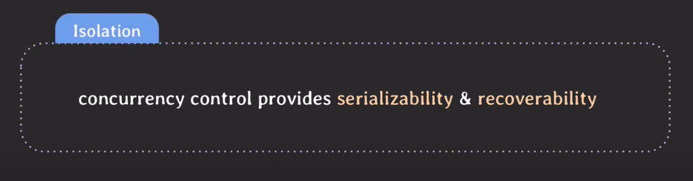

# Concurrency Control

## Serializability

### schedule
- 여러 트랜잭션들이 동시에 실행될 때 각 트랜잭션에 속한 operation들의 실행 순서
    - serial schedule: 트랜잭션들이 겹치지 않고 한번에 하나씩 실행되는 schedule
    - nonserial schedule: 트랜잭션들이 겹쳐서(interleaving) 실행되는 schedule
  > serial vs nonserial 성능: nonserial schedule은 동시성이 높아져서 같은 시간 동안 더 많은 트랜잭션들을 처리할 수 있다

#### nonserial schedule의 문제점
- 트랜잭션들이 어떤 형태로 겹쳐서 실행되는지에 따라 이상한 결과가 나올 수 있다.
- 고민
    1. 성능 때문에 여러 트랜잭션들을 겹쳐서 실행할 수 있으면 좋다(nonserial schedule)
    2. 하지만 nonserial schedule은 이상한 결과를 낼 수 있다.
  > serial schedule과 동일한(equivalent) 결과를 낼 수 있는 nonserial schedule을 실행한다.

### Conflict
- 조건
    1. 서로 다른 트랜잭션 소속
    2. 같은 데이터에 접근
    3. 최소 하나는 write operation
- conflict operation은 순서가 바뀌면 결과도 바뀐다.

#### Confilct equivalent
- 조건
    1. 두 schedule은 같은 트랜잭션들을 포함한다.
    2. 어떤 conflict operation의 순서도 양쪽 scheule 모두 동일하다.

#### Conflict serializable
- 조건
    1. serial schedule과 conflict equivalent한 트랜잭션은 conflict serializable하다.
> conflict serializable한 nonserial schedule을 통해 트랜잭션 성능을 높일 수 있다!!!

## Recoverability

- unrecoverable schedule: schedule 내에서 commit된 트랜잭션이 rollback된 transaction이 write했던 데이터를 읽은 경우 
    - rollback을 해도 이전 상태로 회복 불가능할 수 있기 때문에(지속성을 보장해야하기 때문) 이런 경우는 허용하면 안된다.

#### 어떤 schedule이 recoverable 한가?
- recoverable schedule: schedule내에서 그 어떤 transaction도 자신이 읽은 데이터를 write한 트랜잭션이 먼저 commit/rollback 전까지는 commit하지 않는 경우
    - rollback을 해도 이전 상태로 회복 가능하기 때문에 DBMS는 이런 schedule만 허용해야 한다.
- cascading rollback: 하나의 트랜잭션이 rollback되면 의존성이 있는 다른 트랜잭션도 rollback 해야한다.
    - 문제점: 여러 transaction의 rollback이 연쇄적으로 일어나면 처리하는 비용이 많이 든다
- cascadeless schedule (avoid cascade schedule): schedule 내에서 어떤 트랜잭션도 commit되지 않은 트랜잭션들이 write한 데이터는 **읽지** 않는 경우
- strict schedule: schedule 내에서 어떤 트랜잭션도 commit되지 않은 트랜잭션들이 write한 데이터는 **쓰지도 읽지도** 않는 경우
    - rollback할 때 recovery가 쉽다. transaction 이전 상태로 돌려놓기만 하면 된다.

> strict schedule < cascadeless schedule < recoverable schedule

## 정리

> DBMS는 serializability와 recoverability를 보장해야 한다.
