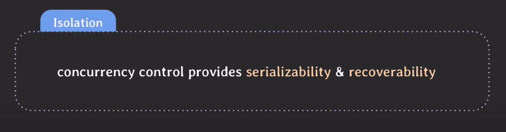

# 트랜잭션

## ACID
- 원자성(Atomicity): 여러 쓰기 작업이 하나의 트랜잭션으로 묶이고 완료(커밋)되거나 결함 발생 시 해당 트랜잭션의 모든 쓰기 작업이 중단(어보트)되거나 둘 중 하나여야 한다.
- 일관성(Consistency): 트랜잭션이 완료될 때 데이터에 관한 불변식이 반드시 만족되어야 하는 특성을 의미한다
- 격리성(Isolation): 동시에 실행되는 트랜잭션은 서로 격리되어야 한다.
- 지속성(Durability): 성공적으로 커밋됐다면 하드웨어 결함이 발생하거나 데이터베이스가 죽더라도 트랜잭션에서 기록한 모든 데이터는 손실되지 않고 지속되어야 한다.

## Concurrency Control

### Serializability

#### schedule
- 여러 트랜잭션들이 동시에 실행될 때 각 트랜잭션에 속한 operation들의 실행 순서
  - serial schedule: 트랜잭션들이 겹치지 않고 한번에 하나씩 실행되는 schedule
  - nonserial schedule: 트랜잭션들이 겹쳐서(interleaving) 실행되는 schedule
  > serial vs nonserial 성능: nonserial schedule은 동시성이 높아져서 같은 시간 동안 더 많은 트랜잭션들을 처리할 수 있다

#### nonserial schedule의 문제점
- 트랜잭션들이 어떤 형태로 겹쳐서 실행되는지에 따라 이상한 결과가 나올 수 있다.
- 고민
  1. 성능 때문에 여러 트랜잭션들을 겹쳐서 실행할 수 있으면 좋다(nonserial schedule)
  2. 하지만 nonserial schedule은 이상한 결과를 낼 수 있다.
- 아이디어
  - serial schedule과 동일한(equivalent) 결과를 낼 수 있는 nonserial schedule을 실행한다.
  
#### Conflict
- 조건
  1. 서로 다른 트랜잭션 소속
  2. 같은 데이터에 접근
  3. 최소 하나는 write operation
- conflict operation은 순서가 바뀌면 결과도 바뀐다.

#### Confilct equivalent
- 조건
  1. 두 schedule은 같은 트랜잭션들을 포함한다.
  2. 어떤 conflict operation의 순서도 양쪽 scheule 모두 동일하다.

#### Conflict serializable
- 조건
  1. serial schedule과 conflict equivalent한 트랜잭션은 conflict serializable하다. 
> conflict serializable한 nonserial schedule을 통해 트랜잭션 성능을 높일 수 있다!!!

### Recoverability

- unrecoverable schedule: schedule 내에서 commit된 트랜잭션이 rollback된 transaction이 write했던 데이터를 읽은 경우 (지속성을 보장해야하기 때문에)
  - rollback을 해도 이전 상태로 회복 불가능할 수 있기 때문에 이런 경우는 허용하면 안된다.

##### 어떤 schedule이 recoverable 한가?
- recoverable schedule: schedule내에서 그 어떤 transaction도 자신이 읽은 데이터를 write한 트랜잭션이 먼저 commit/rollback 전까지는 commit하지 않는 경우
  - rollback을 해도 이전 상태로 회복 가능하기 때문에 DBMS는 이런 schedule만 허용해야 한다.

## 정리

- cascading rollback: 하나의 트랜잭션이 rollback되면 의존성이 있는 다른 트랜잭션도 rollback 해야한다.
  - 문제점: 여러 transaction의 rollback이 연쇄적으로 일어나면 처리하는 비용이 많이 든다
- cascadeless schedule (avoid cascade schedule): schedule 내에서 어떤 트랜잭션도 commit되지 않은 트랜잭션들이 write한 데이터는 **읽지** 않는 경우

- strict schedule: schedule 내에서 어떤 트랜잭션도 commit되지 않은 트랜잭션들이 write한 데이터는 **쓰지도 읽지도** 않는 경우
  - rollback할 때 recovery가 쉽다. transaction 이전 상태로 돌려놓기만 하면 된다.
  
> strict schedule < cascadeless schedule < recoverable schedule

### 다중 객체 연산(트랜잭션)
- 다중 객체 트랜잭션의 필요성
  - 단일 객체 트랜잭션 만으로 충분한 사용 사례가 있지만 많은 경우에 다중 객체 트랜잭션이 필요하다.
      1. 서로 참조하는 여러 레코드를 삽입할 때 참조 키는 항상 올바르고 최신 정보를 반영해야 한다.
      2. 비정규화된 여러 테이블의 데이터들을 한 번에 갱신해야 한다.
      3. 보조 색인이 있는 경우 값이 변경될 때 색인도 함께 갱신되어야 한다.

#### 오류와 어보트 처리
- 트랜잭션의 핵심 기능은 오류가 생기면 어보트되고 안전하게 재시도할 수 있다는 것이다.
- 재시도는 간단하고 효과적인 오류 처리 메커니즘이지만 완벽하지 않다.
    - 트랜잭션이 실제론 커밋되었지만 네트워크 문제로 클라이언트는 실패했다고 생각하여 중복 처리가 될 수 있다.
    - 오류가 과부하 때문이라면 재시도는 더 큰 문제를 만들 수 있다.
    - 일시적인 오류(데드락, 네트워크 오류, 시스템 장애)에만 가치있고 영구적인 오류(제약 조건 위반)는 재시도해도 소용이 없다.

## 완화된 격리 수준

### 커밋 후 읽기
- 데이터베이스에서 읽을 때 커밋된 데이터만 보게 된다(**더티 읽기**가 없음)
- 데이터베이스에 쓸 때 커밋된 데이터만 덮어쓰게 된다(**더티 쓰기**가 없음)

#### 더티 읽기 방지

- 어떤 트랜잭션에서 처리한 작업이 완료되지 않았는데도 다른 트랜잭션에서 볼 수 있는 현상

#### 더티 쓰기 방지

- 어떤 트랜잭션에서 처리한 작업이 완료되지 않았는데도 다른 트랜잭션에서 덮어쓸 수 있는 현상

